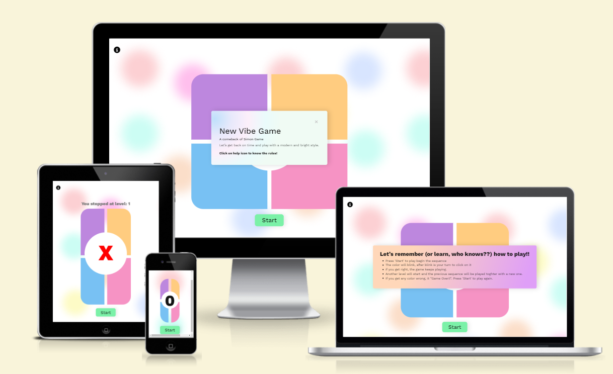
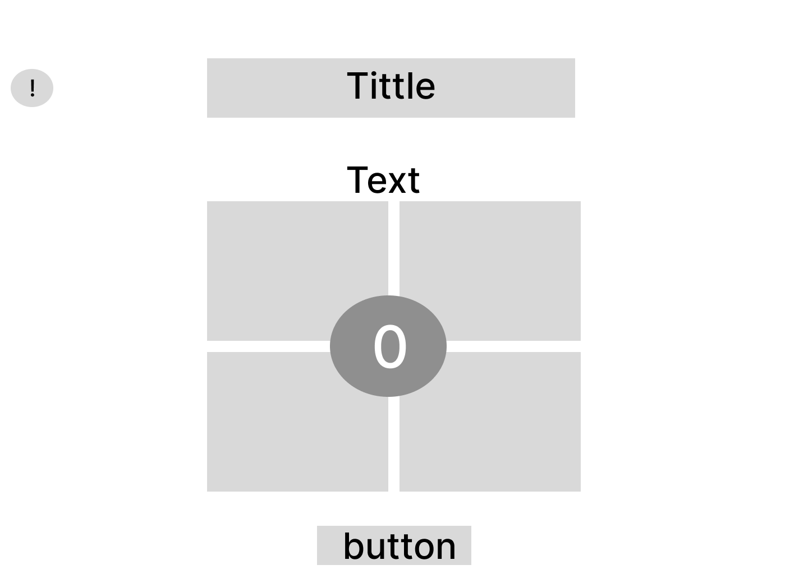
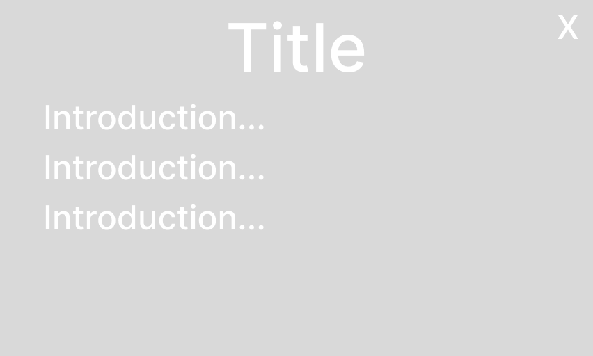
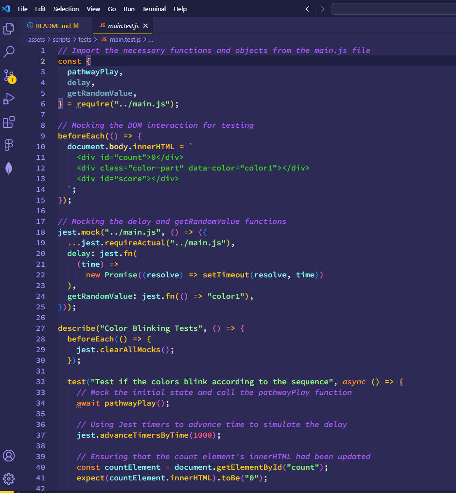
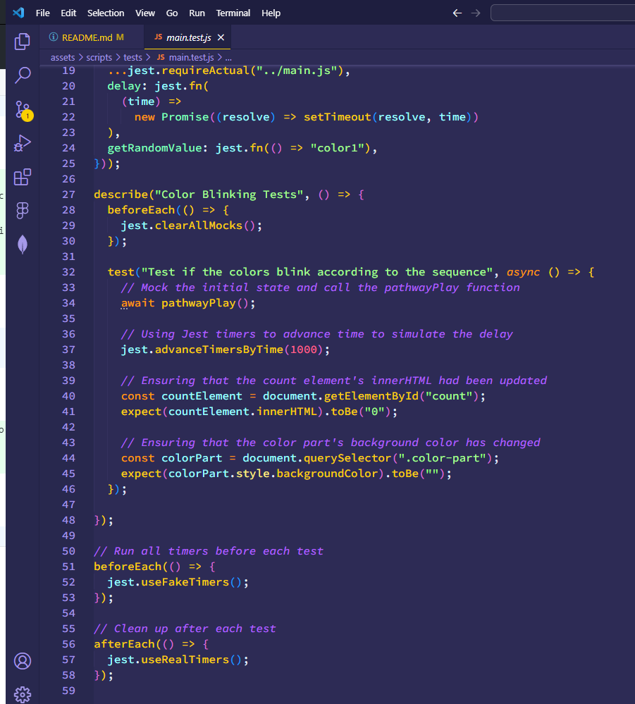
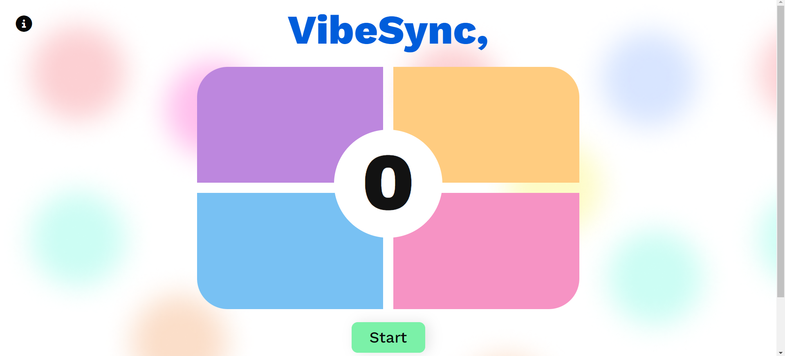
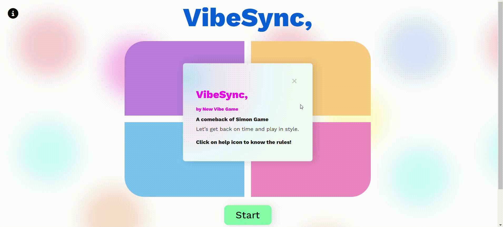
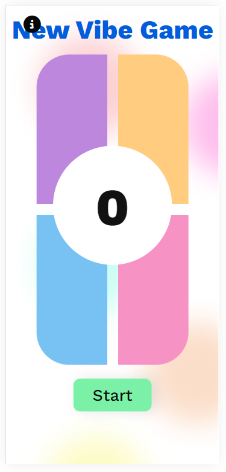

# Simon-Game
 
Welcome to the world of "new vibe" where classic meets contemporary in the realm of web-based gaming. Join us on a journey that reimagines the beloved Simon game with a fresh and vibrant twist.

In "new vibe" we've taken the timeless challenge of Simon and infused it with cutting-edge web technology and interactive features. This isn't your grandparent's Simon game – it's a whole new vibe!

Get ready to put your memory and reflexes to the test as you sync with the colorful patterns and catchy tunes. But "VibeSync" isn't just about following the rhythm; it's about creating your own, too. With our modernized gameplay, you'll be able to share your progress, challenge friends, and experience the game's social side.

So, whether you're a die-hard Simon fan or a newcomer to the world of memory games, "VibeSync" offers something for everyone. Stay tuned as we embark on this thrilling adventure with New Vibe Game and set the stage for a web-based gaming experience that's bound to make your heart race and your brain groove.

[View New Vibe Game on Netlify](https://newvibe-game.netlify.app/)

## CONTENTS

* [User Experience (UX)](#User-Experience-(UX))
  * [Initial Discussion](#Initial-Discussion)
  * [Key Information for the website](#Key-Information-for-the-website)
  * [User Stories](#User-Stories)

* [Design](#Design)
  * [Colour Scheme](#Colour-Scheme)
  * [Typography](#Typography)
  * [Imagery](#Imagery)
  * [Wireframes](#Wireframes)
  * [Features](#Features)
  * [Accessibility](#Accessibility)

* [Technologies Used](#Technologies-Used)
  * [Languages Used](#Languages-Used)
  * [Frameworks, Libraries & Programs Used](#Frameworks,-Libraries-&-Programs-Used)

* [Deployment & Local Development](#Deployment-&-Local-Development)
  * [Deployment](#Deployment)
  * [Local Development](#Local-Development)
    * [How to Fork](#How-to-Fork)
    * [How to Clone](#How-to-Clone)

* [Testing](#Testing)
  * [Manual Testing](#Manual-Testing)
    * [Device and Browser Testing](#Device-and-Browser-Testing)
    * [Manual Testing of User Actions](#Manual-Testing-of-User-Actions)
  * [JavaScript Test](#JavaScript-Test)
  * [Compliant Code](#Compliant-Code)
    * [W3C Validator](#W3C-Validator)
    * [Lighthouse](#Lighthouse)
  * [Testing User Stories](#Testing-User-Stories)
  * [Solved Bugs](#Solved-Bugs)
  
* [Credits](#Credits)
  * [Code Used](#Code-Used)
  * [Content](#Content)
  * [Media](#Media)

- - -

## User Experience (UX)

**Initial Discussion**

New Vibe Game is a forward-thinking game agency renowned for their innovative approach to web-based gaming. They are dedicated to crafting experiences that not only captivate audiences but also set new standards in interactive entertainment. Their commitment to pushing boundaries aligns perfectly with our vision for "New Vibe game"

They look for the right balance betweeb nostalgia and innovation. Bringing back from the past a redesigned with fresh and modern elements of 'Simon Game'. 

**Key information for the site**

* Modernized Interface: A sleek, user-friendly web interface designed for seamless gameplay across various devices.

* Vibrant and Engaging: Utilize a visually stimulating palette to create an immersive environment that complements the gameplay.

* Interactive Elements: Engaging elements that encourage user interaction and enhance the gaming experience.

* Clear Guide: Simple and clear guide for instructions.

**User Stories**

- Client Goals

* Quality Assurance and Bug-Free Gameplay: Conduct thorough testing to identify and rectify any bugs or issues, guaranteeing a polished and reliable gaming experience.

* Interactive Features: Incorporate elements that encourage player engagement and interaction within the game, enhancing overall enjoyment.

* Seamless Web-Based Gameplay: Ensure the game operates smoothly on various web browsers and devices, providing a consistent experience for all players.

* Engaging User Experience: Create a game that captivates players from the first interaction, offering an immersive and enjoyable experience.

* Nostalgia with a Modern Twist: Retain the essence of the classic Simon game while infusing it with contemporary elements to appeal to a broad audience.

- First Time Visitor Goals

* I want to be captivated by the landing page, instantly drawn in by the visuals and intrigued by the concept of the game.

* I hope to receive a clear and concise explanation of how to play "VibeSync" so I can dive right into the action without any confusion.

* Navigating through the game should be intuitive and hassle-free, allowing me to focus on the gameplay itself.

* I hope to enjoy uninterrupted gameplay, without any technical glitches or performance issues that might disrupt my experience.

- Returning Visitor Goals

* It's important to me that the gameplay experience feels familiar but with noticeable improvements in responsiveness, graphics, or user interface.

- - -

## Design

**Colour Scheme**

The game uses a palette of pastel colours and same colour but in the bright tone to assembly a different mordern design. The colour palette was created using the [Coolors](https://coolors.co/) website.

**Typography**

Google Fonts was used for the following font with different font weight:

* Work Sans is used on the whole website. It is a sans-serif font.

**Imagery**

All media was created by myself.

**Wireframes**

Wireframes were created for mobile, tablet and desktop.

**Features**

* The game is composed of a single page with responsive design accessible in all range of devices.
* Start button is hidden once the user start to play and back to visible once stopped.
* A intro popup screen presenting the game load everytime the window start.
* The game is not limited to a number of plays.
* The help button shows popup explaining how to play.
* A content phrase appear once the game is over showing where the user stop.
* Future Implementations.
  * Implement a ranking list to store and display higher scores.
  * Add a sharing button to allow users share their restuls.

**Accessibility**

I have been mindful during coding to ensure that the website is as accessible friendly as possible. I have achieved this by:

* Using semantic HTML.
* Providing information for screen readers where there are icons used and no text - such as the help button and footer section icons.
* Ensuring that there is a sufficient colour contrast throughout the site.
* Provide clear intructions content.

- - -

## Technologies Used

**Languages Used**

HTML, CSS and Java Script were used to create this game.

**Frameworks, Libraries & Programs Used**

- Figma - Used to create wireframes.
- Git - For version control.
- Github - To save and store the files for the website.
- Bootstrap Version 5.3 - The framework for the website. Code for the navigation bar, modal, and form were used and modified. Additional CSS styling was also implemented in style.css.
- Google Fonts - To import the fonts used on the website.
- Font Awesome - For the iconography on the website.
- Google Dev Tools - To troubleshoot and test features, solve issues with responsiveness and styling.

- - -

## Deployment & Local Development

### Deployment

Netfily was used to deploy the live website. The instructions to achieve this are below:

1. Log in (or sign up) with your Github.
2. Click on the Add new site.
3. Find the repository for this project, Simon-Game.
4. Click on Create.
5. Now let it load, once is ready a link to access will be provided.

### Local Development

#### How to Fork

To fork the Simon game repository:

1. Log in (or sign up) to Github.
2. Go to the repository for this project, JuliaLavagnini/Simon-Game.
3. Click the Fork button in the top right corner.

#### How to Clone

To clone the TRIP.-travel-agency-website repository:

1. Log in (or sign up) to GitHub.
2. Go to the repository for this project, JuliaLavagnini/Simon-Game.
3. Click on the code button, select whether you would like to clone with HTTPS, SSH or GitHub CLI and copy the link shown.
4. Open the terminal in your code editor and change the current working directory to the location you want to use for the cloned directory.
5. Type 'git clone' into the terminal and then paste the link you copied in step 3. Press enter.

- - -

## Testing

### Manual Testing

#### Device and Browser Testing

|**Testing**|**iPhone 12 safari**|**iPad Air 10.2" safari**|**HP Pavillion OS Edge**|**HP Pavillion OS Chrome**|**Chrome Developer Tools**|
|-----|-----|-----|-----|-----|-----|
|Responsive|Yes|Yes|Yes|Yes|Yes|
|Intro message is showed when the window is started every time|Yes|Yes|Yes|Yes|Yes|
|Help button is clickable|Yes|Yes|Yes|Yes|Yes|
|Mouse click is playable on the game|Yes|Yes|Yes|Yes|Yes|
|The colours are high visible to instructe the user where to click|Yes|Yes|Yes|Yes|Yes|
|The numbers is updated to show the user progression|Yes|Yes|Yes|Yes|Yes|

#### Manual Testing of User Actions

|**Feature**     |**Action**     |**Expected Behaviour**     |**Result**     |
|----------------|---------------|---------------------------|---------------|
|Intro message|click to close|close the message|Pass|
|help button|click to open/close|open/close the instructions message|Pass|
|Start button|click to start|start the game and hide button|Pass|
|number updated|click colour|guessed correct color and next level|Pass|
|record registreted|click wrong colour|play stop and message "you stropped at level: .. " appear|Pass|
|count reset|click start|reset game|Pass|
|colour blink|click colour after indication|correct guess, next level|Pass|
|wrong guess|click wrong indication|gameplay stop and count goes to '0' and red|Pass|

### JavaScript Test
The Jest tests present on this project was hard to implement has structure did not follow each other between the files. Only one test was implemented to test if the sequence was being displayed correctly and this test pass. So the decision to implement manual tests was giving to be able to still test for functionality. 
This framework washard to follow and understand the test driven development, as a final statement Jest will be implemented in others projects but before more pratice is required to use it in a time sentive project. 

### Compliant Code

#### W3C Validator

The W3C validator was used to validate the HTML on all pages of the website. It was also used to validate CSS in the style.css file. and it all passed.

* [HTML Validator](assets/documentation-media/Html-w3-validator.png)
* [CSS Validator](assets/documentation-media/Css-w3-validator.png)

#### Lighthouse

I used Lighthouse within the Chrome Developer Tools to allow me to test the performance, accessibility, best practices and SEO of the website.

Lighthouse testing :
[Lighthouse Testing for Desktop Index Page](assets/documentation-media/Desktop-analises.png)
[Lighthouse Testing for Mobile Index Page](assets/documentation-media/Mobile-analises.png)

### Testing User Stories

**First Time Visitors**
|**User Story**|**Outcome**|**Screengrabs**|
|-----|-----|-----|
|I want to be captivated by the landing page, instantly drawn in by the visuals and intrigued by the concept of the game.
|design present bright and clear colours with large enough layout||
|I hope to receive a clear and concise explanation of how to play "New vibe game" so I can drive right into the action without any confusion.|Introduction message is present once the window open and instruction message is avaible by a icon button anytime during before, during and after the gameplay.||
|I hope to enjoy uninterrupted gameplay, without any technical glitches or performance issues that might disrupt my experience.|The gameplay does not present any error with the gameplay.||

**Returning Visitors**
|**User Story**|**Outcome**|**Screengrabs**|
|It's important to me that the gameplay experience feels familiar but with noticeable improvements in responsiveness, graphics, or user interface.|responsive screen is present from desktop to tablets and mobiles.||

### Solved Bugs

|**Bug**|**Resolution**|
|-----|-----|
|'undefine' code due to clickable colours active with no start button selected| Put ColourPart loop into a function to only initiate when the user click on 'Start' button and disable clickables colours.
|record registrated message not appearing once game is stopped| Misspelled error fixed on javascript file.|
|sequence breaking and not reseting properly| Fix pathwayPlay function to reset to zero every time is starting again and adding a reset function and add it to start button to not conflict with the pathwayPlay function.|
|sequence not accepting user input after first round| lose function was added and validation to only load the game events once the game was started was implemented. Also, on pathwayPlay the variable 'index' was added to set to zero to not conflite with previous rounds. |

- - -

## Credits

**Code Used**

- boostrap pop up code was not working so I searched online and found automatic pop-up screen code to show automated and allow user interaction with it. Changes were added to follow the appropriate purpose. [Coding Artist - Automatic Pop-Up Javascript](https://codingartistweb.com/2021/08/show-popup-automatically-after-page-load-using-javascript/)

- The below codes was provided by my friend that was helping solve the gameplay problem:
async function delay(time) {
  return await new Promise((resolve) => {
    setTimeout(resolve, time);
  });
}

const getRandomValue = (obj) => {
  let arr = Object.keys(obj);
  return arr[Math.floor(Math.random() * arr.length)];
};

**Content**

- Content for the game was written by the owner Julia Lavagnini.

**Media**

- All media used from self creation.
- [Am I Responsive?](http://ami.responsivedesign.is/) To show the website image on a range of devices.
- [Shields.io](https://shields.io/) To add badges to the README

icon from service section was part of Font Anwesome website.
- [Font Anwesome - help-info](https://fontawesome.com/icons/circle-info?f=classic&s=solid)
- [Font Anwesome - heart](https://fontawesome.com/icons/heart?f=classic&s=solid)
- [Font Anwesome - github](https://fontawesome.com/icons/github?f=brands&s=solid)

